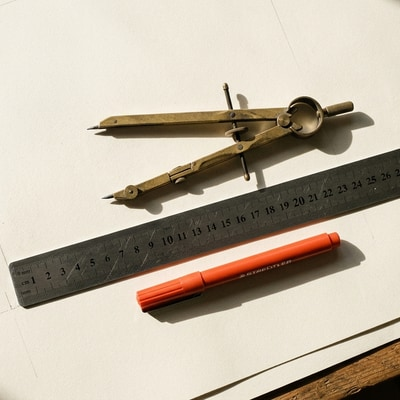
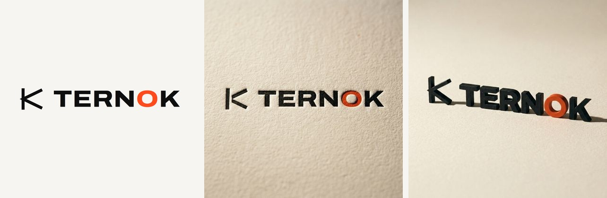

<p align="center">
  
</p>

<h1 align="center">nano-banana-mcp</h1>

<p align="center">
  <strong>Servidor MCP para generar imágenes con Nano Banana, el modelo de imagen de <a href="https://labs.google/fx/tools/flow">Google Flow</a> — en el tamaño exacto en píxeles que pidas, descargadas directo a disco.</strong>
</p>

<p align="center">
  <a href="LICENSE"></a>
  
  
  <a href="README.md"></a>
</p>

<p align="center"><sub><a href="README.md">Read in English</a></sub></p>

---

```
generate_image(prompt: "un zorro naranja sobre fondo blanco", size: "1200x630")
-> imagenes/un-zorro-naranja-sobre-fondo-blanco.jpg   1200x630   0 puntos
```

> **Todas las imágenes de este README las generó este servidor.** La cabecera, los recortes de abajo y los renders
> del logo. Ninguna está retocada a mano.

---

## Qué resuelve

Flow genera en cinco relaciones de aspecto fijas: 16:9, 4:3, 1:1, 3:4 y 9:16. Un encargo de diseño real casi nunca
cae justo en una de ellas — un Open Graph son 1200×630, un banner de repo 1456×180, un avatar 400×400.

Este servidor genera en la relación nativa más cercana y recorta al tamaño exacto, con detección de saliencia para
que el recorte no te decapite al sujeto. Le pedís `1200x630` y recibís un archivo de 1200×630.

**Una generación, tres tamaños.** El mismo original recortado de tres formas — mirá cómo el recorte sigue al sujeto
en vez de agarrar el centro a ciegas:

| `1200x630` — Open Graph | `400x400` — avatar |
| --- | --- |
|  |  |

`1456x180` — banner de repo


## Imágenes de referencia

Le das una imagen y el prompt deja de describir qué *crear* para describir qué *cambiar*. Le pasás un logo plano y le
pedís que lo imprima en letterpress sobre papel de algodón, o que lo funda como cartelería mate:



<sub>Izquierda: el vector original, entregado como referencia. Centro y derecha: dos generaciones a partir de él,
cuatro variantes cada una, 0 puntos, alrededor de un minuto por tanda.</sub>

```jsonc
generate_image({
  prompt: "este logo impreso en letterpress sobre papel de algodón, luz rasante",
  reference_images: ["assets/logo.png"],
  count: 4
})

// ¿iterando sobre la misma referencia? no la vuelvas a subir
generate_image({
  prompt: "igual, pero con la impresión más profunda y el grano del papel visible",
  reference_library_names: ["logo.png"],
  count: 4
})
```

Flow no acepta un archivo directo en el compositor: primero sube a la biblioteca del proyecto y después se elige desde
ahí. Los dos pasos están resueltos, incluido el clic de confirmar que es el que realmente adjunta. Cualquier
referencia que haya quedado de un turno anterior se limpia antes: una olvidada cambia la imagen sin que nada lo
indique, y el resultado se le termina atribuyendo al prompt.

## Cómo funciona

Flow no tiene API pública. La llamada interna de generación va firmada con un token de reCAPTCHA Enterprise que acuña
el JavaScript de la propia página, así que **no se puede replicar desde fuera del navegador** — y este proyecto no lo
intenta. Esa sola restricción define todo el diseño.

Entonces hace lo que haría una persona: escribe en el compositor y aprieta Enter. La diferencia está en cómo lee el
resultado.

**Intercepta la respuesta de red de la propia página** en vez de mirar la biblioteca esperando que aparezca algo
nuevo. Esa respuesta ya trae el id del medio, las dimensiones reales y una URL firmada, así que no hay polling, no hay
que adivinar cuál miniatura es la tuya, y no hay ambigüedad si hay varias generaciones en vuelo. La única parte frágil
que queda es escribir el prompt.

**Un pedido, cuatro respuestas.** Si pedís cuatro variantes, Flow no devuelve un arreglo: manda cuatro respuestas HTTP
separadas, escalonadas por un par de segundos. Esperar "la próxima respuesta" descarta tres en silencio y se ve
exactamente igual que un límite de la cuenta. El colector escucha el flujo completo y cierra por lo que ocurra
primero: llegaron todas, pasaron 20 segundos sin novedad, o se agotó el tiempo. Nunca descarta lo ya recibido.

**Los anclajes en la interfaz son nombres de ligature de Material Symbols** (`crop_16_9`, `image`, `add_2`) y
etiquetas numéricas (`16:9`, `x4`). Son identificadores, no texto traducible: funciona igual con la interfaz en
español, inglés o japonés.

**El portón del costo se cierra antes de enviar.** El servidor lee el costo que **Flow mismo** calcula en su panel de
configuración y aborta si supera `FLOW_MAX_COST`, que viene en 0. La negativa ocurre mientras negarse todavía es
gratis. Si el número no se puede leer, tampoco envía: no adivina.

## Requisitos

- Node.js 20 o superior
- Google Chrome
- Una cuenta de Google con acceso a Flow

## Instalación

```bash
git clone https://github.com/frannkurt/nano-banana-mcp.git
cd nano-banana-mcp
npm install
npm run build
```

## Puesta en marcha

### 1. Abrí Chrome con depuración remota

Tiene que ser un perfil aparte del que usás todos los días.

**Windows**

```bash
"C:\Program Files\Google\Chrome\Application\chrome.exe" --remote-debugging-port=9222 --user-data-dir="%USERPROFILE%\.nano-banana-mcp\chrome" https://labs.google/fx/tools/flow
```

**macOS**

```bash
"/Applications/Google Chrome.app/Contents/MacOS/Google Chrome" --remote-debugging-port=9222 --user-data-dir="$HOME/.nano-banana-mcp/chrome" https://labs.google/fx/tools/flow
```

**Linux**

```bash
google-chrome --remote-debugging-port=9222 --user-data-dir="$HOME/.nano-banana-mcp/chrome" https://labs.google/fx/tools/flow
```

### 2. Iniciá sesión y abrí un proyecto

En esa ventana, entrá con tu cuenta de Google y abrí un proyecto de Flow. La URL tiene que quedar en
`labs.google/fx/tools/flow/project/<id>`.

Sin un proyecto abierto no existe el compositor, y sin compositor no se puede generar.

### 3. Registrá el servidor

En Claude Code:

```bash
claude mcp add nano-banana --env FLOW_CDP_URL=http://127.0.0.1:9222 --env FLOW_OUTPUT_DIR=./imagenes -- node /ruta/a/nano-banana-mcp/dist/index.js
```

O a mano, en la configuración de tu cliente MCP:

```json
{
  "mcpServers": {
    "nano-banana": {
      "command": "node",
      "args": ["/ruta/a/nano-banana-mcp/dist/index.js"],
      "env": {
        "FLOW_CDP_URL": "http://127.0.0.1:9222",
        "FLOW_OUTPUT_DIR": "./imagenes",
        "FLOW_MAX_COST": "0"
      }
    }
  }
}
```

### 4. Verificá

```bash
node scripts/smoke.mjs "un zorro naranja sobre fondo blanco" 1200x630
```

## Herramientas

### `flow_status`

Estado de la conexión: sesión, cuenta, proyecto abierto, saldo de puntos. Empezá por acá cuando algo falle.

### `generate_image`

| Parámetro                 | Tipo                            | Por defecto         | Qué hace                                                          |
| ------------------------- | ------------------------------- | ------------------- | ----------------------------------------------------------------- |
| `prompt`                  | string                          | —                   | Descripción de la imagen, en cualquier idioma                      |
| `size`                    | string                          | nativo              | Tamaño exacto, `"ANCHOxALTO"`, por ejemplo `"1200x630"`            |
| `aspect`                  | `16:9` `4:3` `1:1` `3:4` `9:16` | derivado de `size`  | Relación nativa a generar                                          |
| `count`                   | 1–4                             | 1                   | Cuántas variantes                                                  |
| `reference_images`        | string[]                        | —                   | Rutas locales a usar como referencia; se suben y adjuntan solas    |
| `reference_library_names` | string[]                        | —                   | Archivos que ya están en la biblioteca, adjuntados sin volver a subirlos |
| `out_dir`                 | string                          | `FLOW_OUTPUT_DIR`   | Carpeta destino                                                    |
| `basename`                | string                          | derivado del prompt | Nombre base de los archivos                                        |
| `format`                  | `jpg` `png` `webp`              | `jpg`               | Formato de salida                                                  |
| `fit`                     | `cover` `contain`               | `cover`             | `cover` recorta para llenar, `contain` rellena los bordes          |

Devuelve las rutas guardadas, el id de cada medio y una miniatura de cada resultado, para que el modelo pueda ver qué
salió y decidir si vale la pena reintentar.

### `download_image`

Baja una imagen ya existente por su id de medio, con recorte opcional. Sirve para recuperar algo generado antes o para
sacar varios tamaños del mismo original.

## Configuración

| Variable                   | Por defecto             | Qué hace                            |
| -------------------------- | ----------------------- | ----------------------------------- |
| `FLOW_CDP_URL`             | `http://127.0.0.1:9222` | Endpoint de depuración del Chrome   |
| `FLOW_OUTPUT_DIR`          | `~/nano-banana-images`  | Dónde se guardan las imágenes       |
| `FLOW_MAX_COST`            | `0`                     | Techo de puntos por generación      |
| `FLOW_GENERATE_TIMEOUT_MS` | `180000`                | Cuánto esperar la respuesta de Flow |

## Generar en paralelo

El compositor es un único elemento por pestaña, así que dos generaciones en la misma se pisan escribiendo el prompt.
Con una pestaña por hilo no chocan: cada una espera su propia respuesta de red, así que no hay duda sobre qué imagen
es de quién.

`ensureFlowTabs(n)` clona la pestaña del proyecto tantas veces como haga falta. Es una API de librería y no una
herramienta MCP, porque cuántos hilos usar es una decisión del script que llama:

```js
import { ensureFlowTabs } from "nano-banana-mcp/dist/browser.js";
import { generateImages } from "nano-banana-mcp/dist/generate.js";

const tabs = await ensureFlowTabs(4);
await Promise.all(prompts.map((prompt, i) =>
  generateImages({ prompt, aspect: "16:9", count: 4, page: tabs[i % tabs.length].page })
));
```

Cuatro pestañas por cuatro variantes son dieciséis imágenes por ciclo. En la práctica, unas 40 imágenes en cinco
minutos.

## Sobre el costo

Las imágenes en Flow cuestan **0 puntos**. El vídeo cuesta, y bastante.

El portón de arriba es lo que sostiene eso por diseño y no por confianza: el servidor lee el costo que cotiza Flow y
se niega a enviar cualquier cosa por encima del techo.

## Hoja de ruta

**La generación de vídeo y de escenas está en desarrollo.** Todavía no está disponible: hoy este servidor genera
solamente imágenes.

El vídeo es donde el portón del costo deja de ser una formalidad, así que va a llegar detrás de un `FLOW_MAX_COST`
explícito distinto de cero y una confirmación por llamada. Nada que gaste puntos va a correr porque un valor por
defecto lo dejó pasar.

## Privacidad y credenciales

- **Nunca maneja una credencial.** Se engancha a una sesión que abriste vos a mano.
- El saldo se consulta con un token que se lee y se usa **dentro de la pestaña**. Ese token nunca cruza a este
  proceso, nunca se escribe a disco y nunca se registra.
- No se envía nada a ningún servidor que no sea Google Flow.

## Problemas frecuentes

**"No pude conectarme a Chrome"** — Chrome no está corriendo con `--remote-debugging-port=9222`, o lo abriste sin
`--user-data-dir` propio y se pegó a una instancia que ya existía. Cerrá todas las ventanas de ese perfil y volvé a
lanzarlo con el comando de arriba.

**"No hay ninguna pestaña de labs.google abierta"** — abrí Flow en esa ventana de Chrome.

**"No encontré el compositor"** — estás en la lista de proyectos, no adentro de uno. La URL tiene que incluir
`/project/`.

**"No pude leer cuánto va a costar"** — la interfaz de Flow cambió. El mensaje de error incluye el texto que sí se
leyó; abrí un issue pegándolo y se arregla en un solo lugar.

**"No encontré X en el selector de la biblioteca"** — el archivo de referencia no está en la biblioteca de este
proyecto, o el nombre no coincide. Revisá el nombre exacto con el que se subió.

**Se generó pero el recorte quedó mal** — probá `fit: "contain"`, o pedí una `aspect` explícita más cercana a tu
tamaño final en vez de dejar que se derive.

## Limitaciones

- Solo imágenes. Vídeo y escenas están en desarrollo, todavía no disponibles.
- Necesita una ventana de Chrome visible y logueada. No funciona headless ni en CI.
- Depende de la interfaz de Flow para escribir el prompt. Google puede cambiarla; cuando pase, se rompe el paso de
  envío y hay que ajustarlo.
- No es un producto de Google, ni está avalado ni afiliado a Google.

## Licencia

Apache-2.0. Ver [LICENSE](LICENSE).
